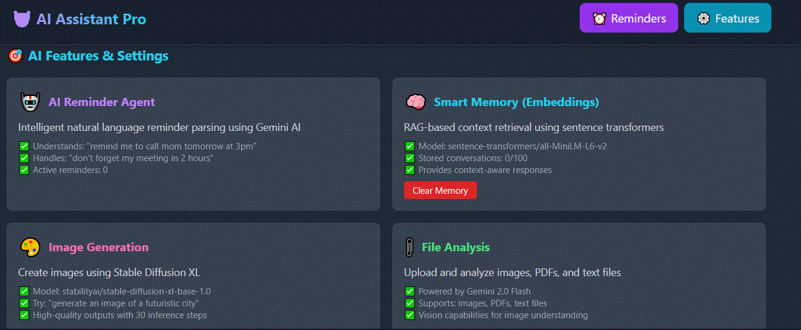

# 🤖 AI Assistant Pro

> A powerful AI-powered assistant with advanced chat capabilities, image generation, and intelligent task management built with React, TypeScript, and modern AI APIs.

[](https://reactjs.org/)
[](https://www.typescriptlang.org/)
[](https://vitejs.dev/)
[](LICENSE)

---

## 📸 Screenshots

### 💬 Chat Interface

*Intelligent conversational AI with context-aware responses*

### 🎨 Image Generation

*Create stunning AI-generated images from text prompts*

### ✨ Key Features

*All-in-one AI assistant for productivity and creativity*

---

## ✨ Features

### 🧠 Intelligent Chat Assistant
- **Natural Language Processing**: Context-aware conversations with advanced AI models
- **Multi-turn Conversations**: Maintains context across multiple messages
- **Code Assistance**: Help with coding, debugging, and technical questions
- **Real-time Responses**: Fast and accurate AI-powered replies

### 🎨 AI Image Generation
- **Text-to-Image**: Generate creative images from text descriptions
- **Multiple Styles**: Support for various artistic styles and formats
- **High Quality Output**: Professional-grade image generation
- **Batch Processing**: Generate multiple variations at once

### 📝 Smart Reminders & Task Management
- **Intelligent Reminders**: Set and manage reminders with natural language
- **Task Scheduling**: Organize your daily tasks efficiently
- **Notifications**: Never miss important deadlines
- **Context Integration**: Reminders based on your conversations

### 🔧 Additional Features
- **Modern UI/UX**: Clean, intuitive interface built with React and Tailwind CSS
- **Responsive Design**: Works seamlessly on desktop and mobile devices
- **Theme Support**: Light and dark mode options
- **Fast Performance**: Optimized with Vite for lightning-fast load times
- **Type-Safe**: Built entirely with TypeScript for reliability

---

## 🚀 Quick Start

### Prerequisites

Make sure you have the following installed:
- **Node.js** (v18 or higher)
- **npm** or **yarn**
- **Git**

### Installation

1. **Clone the repository**
   ```bash
   git clone https://github.com/Ibrahim2656/AI-Assistant-Pro.git
   cd AI-Assistant-Pro
   ```

2. **Install dependencies**
   ```bash
   npm install
   # or
   yarn install
   ```

3. **Set up environment variables**
   
   Create a `.env` file in the root directory:
   ```env
   VITE_ANTHROPIC_API_KEY=your_anthropic_api_key_here
   VITE_OPENAI_API_KEY=your_openai_api_key_here
   # Add other API keys as needed
   ```

4. **Start the development server**
   ```bash
   npm run dev
   # or
   yarn dev
   ```

5. **Open your browser**
   
   Navigate to `http://localhost:5173`

---

## 🛠️ Tech Stack

### Frontend
- **React 18.3** - UI library
- **TypeScript 5.6** - Type-safe JavaScript
- **Vite 6.0** - Next-generation frontend tooling
- **Tailwind CSS** - Utility-first CSS framework

### AI Services
- **Anthropic Claude** - Advanced conversational AI
- **OpenAI API** - GPT models for chat and image generation
- **Custom Embedding Service** - Semantic search and context

### State Management & Tools
- **React Hooks** - Modern state management
- **Context API** - Global state handling
- **LocalStorage** - Client-side data persistence

---

## 📁 Project Structure

```
AI-Assistant-Pro/
├── components/           # React components
│   ├── ChatInput.tsx    # Chat input component
│   ├── ChatMessage.tsx  # Message display component
│   └── Icons.tsx        # Icon components
├── services/            # API services
│   ├── EmbeddingService.ts
│   ├── ReminderService.ts
│   └── Service.ts
├── public/              # Static assets
├── src/
│   ├── App.tsx         # Main application component
│   ├── index.tsx       # Entry point
│   └── types.ts        # TypeScript type definitions
├── .env                # Environment variables (create this)
├── .gitignore          # Git ignore rules
├── package.json        # Dependencies and scripts
├── tsconfig.json       # TypeScript configuration
├── vite.config.ts      # Vite configuration
└── README.md           # This file
```

---

## 🎯 Usage Examples

### Chat with the Assistant
```typescript
// Start a conversation
const response = await sendMessage("What's the weather like today?");

// Follow-up questions maintain context
const followUp = await sendMessage("How about tomorrow?");
```

### Generate Images
```typescript
// Create an image from a text prompt
const image = await generateImage({
  prompt: "A futuristic city at sunset",
  style: "photorealistic",
  size: "1024x1024"
});
```

### Set Reminders
```typescript
// Set a reminder using natural language
await createReminder({
  text: "Team meeting at 3 PM tomorrow",
  context: currentConversation
});
```

---

## 🔑 API Configuration

### Anthropic API
1. Get your API key from [Anthropic Console](https://console.anthropic.com/)
2. Add to `.env`: `VITE_ANTHROPIC_API_KEY=your_key_here`

### OpenAI API
1. Get your API key from [OpenAI Platform](https://platform.openai.com/)
2. Add to `.env`: `VITE_OPENAI_API_KEY=your_key_here`

---

## 🤝 Contributing

Contributions are welcome! Here's how you can help:

1. **Fork the repository**
2. **Create a feature branch**
   ```bash
   git checkout -b feature/amazing-feature
   ```
3. **Commit your changes**
   ```bash
   git commit -m 'Add some amazing feature'
   ```
4. **Push to the branch**
   ```bash
   git push origin feature/amazing-feature
   ```
5. **Open a Pull Request**

### Development Guidelines
- Follow the existing code style
- Write meaningful commit messages
- Add tests for new features
- Update documentation as needed
- Ensure all tests pass before submitting

---

## 📝 License

This project is licensed under the **MIT License** - see the [LICENSE](LICENSE) file for details.

---

## 🙏 Acknowledgments

- [Anthropic](https://www.anthropic.com/) for Claude AI
- [OpenAI](https://openai.com/) for GPT models
- [React](https://reactjs.org/) team for the amazing framework
- [Vite](https://vitejs.dev/) for the blazing-fast build tool
- All contributors who help improve this project

---

## 📬 Contact & Support

- **GitHub**: [@Ibrahim2656](https://github.com/Ibrahim2656)
- **Issues**: [Report a bug](https://github.com/Ibrahim2656/AI-Assistant-Pro/issues)
- **Discussions**: [Join the conversation](https://github.com/Ibrahim2656/AI-Assistant-Pro/discussions)

---

## 🗺️ Roadmap

- [ ] Voice input/output support
- [ ] Multi-language support
- [ ] Plugin system for extensibility
- [ ] Advanced file handling (PDF, Documents)
- [ ] Team collaboration features
- [ ] Mobile app version
- [ ] Offline mode capabilities
- [ ] Advanced customization options

---

## ⭐ Show Your Support

If you find this project useful, please consider giving it a star on GitHub! It helps others discover the project and motivates continued development.

[](https://github.com/Ibrahim2656/AI-Assistant-Pro)

---
Built with ❤️ by Ibrahim
